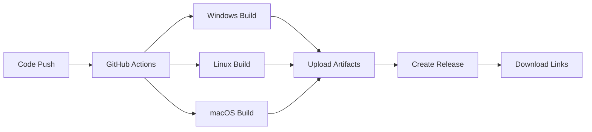

# PDF Coordinate Viewer

A lightweight desktop PDF viewer application that tracks and displays X-Y coordinates of clicked points with customizable coordinate origins.

## Features

- **PDF Rendering**: Load and display multipage PDF files using PyMuPDF
- **Coordinate Tracking**: Click anywhere on a PDF page to get precise coordinates
- **Multiple Origin Points**: Choose from four coordinate origins:
  - Top-Left (default)
  - Top-Right
  - Bottom-Left  
  - Bottom-Right
- **Page Navigation**: Navigate through multipage PDFs with next/previous buttons
- **Zoom Controls**: Zoom in/out and reset zoom for better precision
- **Visual Markers**: Red circle and cross markers show clicked points
- **Click History**: Track all clicks with page numbers and coordinates
- **Export Functionality**: Export click history to CSV format
- **Keyboard Shortcuts**: Arrow keys for navigation, Ctrl+O to open files

## Installation & Usage

### Option 1: Download Pre-built Executables (Recommended)

**For end users who just want to use the application:**

#### 🚀 Quick Download
1. Go to the [Releases](../../releases) page
2. Download the appropriate version for your operating system:
   - **Windows**: `PDF-Coordinate-Viewer-windows-x64.zip`
   - **Linux**: `PDF-Coordinate-Viewer-linux-x64.tar.gz`
   - **macOS**: `PDF-Coordinate-Viewer-macos-x64.tar.gz`
3. Extract and run:
   - **Windows**: Double-click `PDF-Coordinate-Viewer.exe`
   - **Linux/macOS**: Run `./PDF-Coordinate-Viewer` (may need `chmod +x`)

**No Python installation required!** 🎉

#### 📦 What's Included
Each release package contains:
- Standalone executable (~44MB, includes Python runtime)
- Documentation (`README.md`, `USAGE.txt`)
- Build information (`build-info.json`)

### Option 2: Run from Source

This project uses `uv` for package management. Make sure you have `uv` installed.

```bash
# Install dependencies
uv sync

# Run the application
uv run python main.py
```

## Multi-Platform Build System

### 🔧 Automated Builds (GitHub Actions)

The project includes **automated multi-platform builds** using GitHub Actions:

#### Triggers
- **Push to main/develop**: Creates development builds
- **Create release tag** (e.g., `v1.0.0`): Creates official releases  
- **Pull requests**: Validates builds work on all platforms
- **Manual dispatch**: On-demand builds

#### Supported Platforms
| Platform | Architecture | Executable | Package Format |
|----------|-------------|------------|----------------|
| Windows  | x64         | `.exe`     | `.zip`         |
| Linux    | x64         | binary     | `.tar.gz`      |
| macOS    | x64         | binary     | `.tar.gz`      |

#### Build Process
1. **Parallel Builds**: All platforms build simultaneously
2. **Quality Checks**: Import tests, dependency verification
3. **Artifact Generation**: Executables + portable packages
4. **Automatic Releases**: Tagged commits create GitHub releases
5. **Build Summary**: Detailed reports with file sizes

### 🏗️ Local Building

#### Quick Build Scripts

**Linux/Mac:**
```bash
./build.sh
```

**Windows:**
```batch
build.bat  
```

**Test Build System:**
```bash
uv run python build-all.py  # Comprehensive build testing
```

#### Manual Build Process

```bash
# 1. Install build dependencies
uv sync --dev

# 2. Build for current platform
uv run python build.py

# 3. Test the build system
uv run python build-all.py
```

### 📊 Build Output

After building, you'll get:

```
📁 dist/
  └── PDF-Coordinate-Viewer-{platform}-{arch}(.exe)

📦 PDF-Coordinate-Viewer-{platform}-{arch}-Portable/
  ├── PDF-Coordinate-Viewer(.exe)
  ├── README.md
  ├── USAGE.txt
  └── build-info.json

📋 release-info.json                    # Build metadata
```

**Platform Tags:**
- `windows-x64` - Windows 64-bit
- `linux-x64` - Linux 64-bit  
- `macos-x64` - macOS 64-bit

### 🚀 Creating Releases

#### For Maintainers

1. **Test locally:**
   ```bash
   uv run python build-all.py
   ```

2. **Create release tag:**
   ```bash
   git tag v1.0.0
   git push origin v1.0.0
   ```

3. **Automated process:**
   - GitHub Actions builds all platforms
   - Creates GitHub release with assets
   - Generates release notes
   - Uploads platform-specific packages

#### For Contributors

1. **Development builds:** Push to `main` or `develop`
2. **Testing builds:** Create pull request
3. **Download artifacts:** Check Actions tab for build results

### 🔧 Advanced Build Configuration

#### Platform-Specific Settings

The build system automatically configures platform-specific options:

**Windows:**
- Excludes Unix-specific modules
- Creates `.exe` executable
- Windows-style documentation

**Linux:**
- Excludes Windows modules  
- Sets up virtual display for testing
- Installs system dependencies

**macOS:**
- Excludes Windows modules
- Sets bundle identifier
- Handles unsigned app requirements

#### Customization

Modify `build.py` for advanced customization:

```python
# Custom PyInstaller arguments
def get_platform_specific_args(platform_info):
    base_args = [
        "--icon", "icon.ico",        # Custom icon
        "--add-data", "data:data",   # Include data files
        "--exclude-module", "unused", # Reduce size
        # ... more options
    ]
```

### 🐛 Troubleshooting Builds

#### Common Issues

**Build Fails:**
- Check Python 3.11+ installed
- Verify `uv sync --dev` completed
- Check system dependencies (Linux)

**Large File Size:**
- Review excluded modules in `build.py`
- Check for unnecessary imports
- Consider `--onedir` instead of `--onefile`

**Platform-Specific:**
- **Linux**: Install `python3-tk`, `xvfb` for headless
- **Windows**: Allow through Windows Defender
- **macOS**: Right-click → "Open" for unsigned apps

#### Debug Mode

Enable console output for debugging:
```bash
# Modify build.py temporarily
"--console",    # Show console window
"--debug",      # Debug mode
```

### 📈 Build Metrics

The automated builds provide detailed metrics:

- **Executable sizes** (~44MB typical)
- **Build times** (5-10 minutes per platform)  
- **Success rates** (tracked per platform)
- **Artifact retention** (30 days dev, 90 days release)

## Usage

### Opening a PDF
1. Click "Open PDF" button or press `Ctrl+O`
2. Select a PDF file from the file dialog
3. The first page will be displayed in the main canvas area

### Coordinate Tracking
1. Select your desired coordinate origin from the dropdown menu
2. Click anywhere on the PDF page
3. Coordinates will be displayed in the "Current Click" panel
4. Each click adds a visual marker (red circle with cross)
5. All clicks are logged in the "Click History" panel

### Navigation
- Use "◀ Previous" and "Next ▶" buttons to navigate pages
- Or use left/right arrow keys for keyboard navigation
- Current page number is displayed between navigation buttons

### Zoom Controls
- **Zoom In**: Increase magnification for better precision
- **Zoom Out**: Decrease magnification to see more content
- **Reset**: Return to 100% zoom level

### Coordinate Origins
The application transforms coordinates from PyMuPDF's default top-left origin to your selected origin:
- **Top-Left**: (0,0) at upper-left corner (default)
- **Top-Right**: (0,0) at upper-right corner
- **Bottom-Left**: (0,0) at lower-left corner
- **Bottom-Right**: (0,0) at lower-right corner

### Exporting Data
1. Click "Export CSV" to save click history
2. Choose location and filename for the CSV file
3. File contains: Page, Origin, Raw_X, Raw_Y, Adjusted_X, Adjusted_Y

## Technical Details

### Architecture
- **GUI Framework**: Tkinter (lightweight, cross-platform)
- **PDF Engine**: PyMuPDF (fitz) for high-quality rendering
- **Image Processing**: Pillow for image format conversion
- **Coordinate System**: Modular transformation logic for different origins
- **Packaging**: PyInstaller for executable generation
- **CI/CD**: GitHub Actions for automated multi-platform builds

### Key Components
- `OriginPoint`: Enum for coordinate origin options
- `ClickData`: Data class for storing click information
- `CoordinateTransformer`: Static methods for coordinate transformations
- `PDFViewer`: Main application class with GUI and logic

### Coordinate Transformation
The `adjust_coordinates()` function converts between coordinate systems:
```python
def adjust_coordinates(raw_x, raw_y, page_width, page_height, origin):
    # Transforms from top-left origin to selected origin
    # Returns (adjusted_x, adjusted_y)
```

## Development

### Project Structure
```
pdf-viewer/
├── main.py                          # Main application code
├── build.py                         # Multi-platform build script
├── build-all.py                     # Build system testing
├── build.sh                         # Linux/Mac build script
├── build.bat                        # Windows build script
├── pyproject.toml                   # Project configuration and dependencies
├── README.md                        # This documentation
├── .github/workflows/               # CI/CD automation
│   └── build-multiplatform.yml      # Multi-platform build workflow
├── dist/                            # Built executables (after build)
├── PDF-Coordinate-Viewer-*-Portable/# Distribution packages (after build)
└── .venv/                           # Virtual environment (created by uv)
```

### Dependencies

**Runtime:**
- `PyMuPDF>=1.23.0`: PDF rendering and manipulation
- `Pillow>=10.0.0`: Image processing and format conversion

**Development:**
- `pyinstaller>=6.0.0`: Executable packaging

### CI/CD Pipeline



### Extending the Application
The code is designed to be modular and extensible:
- Add new coordinate origins by extending the `OriginPoint` enum
- Implement additional export formats by extending the export methods
- Add measurement tools by extending the click handling logic
- Integrate with CAD systems by extending the coordinate transformation system

### Platform-Specific Notes

**Windows:**
- Executable includes `.exe` extension
- Windows Defender may scan the executable on first run
- Build creates Windows-style paths in documentation

**Linux:**
- Executable has no extension
- May need to set executable permissions: `chmod +x`
- Requires X11 or Wayland for GUI display

**macOS:**
- Similar to Linux but may require developer signing for distribution
- May need to right-click → "Open" for unsigned executables
- Apple Silicon (ARM64) support planned for future releases

## Requirements

**For Running Executable:**
- Operating System: Linux, Windows, or macOS
- Display server (for GUI)
- **No Python installation required** ✅

**For Development:**
- Python 3.11 or higher
- uv package manager
- Display server (for GUI)

**For Building:**
- All development requirements
- PyInstaller (installed via `uv sync --dev`)
- Platform-specific system libraries (handled automatically)

## Troubleshooting

### Build Issues
- **PyInstaller not found**: Run `uv sync --dev` to install dependencies
- **Import errors**: Check hidden imports in `build.py`
- **Size too large**: Consider using `--exclude-module` for unused packages
- **CI build fails**: Check GitHub Actions logs for platform-specific errors

### Runtime Issues
- **Won't launch**: Check console output with `--console` build option
- **PDF won't load**: Ensure PDF file is not corrupted or password-protected
- **Coordinates wrong**: Verify page dimensions and zoom level

### Platform Issues
- **Linux**: Ensure X11 forwarding if using SSH
- **Windows**: Allow through Windows Defender if needed
- **macOS**: Use right-click → "Open" for unsigned executables

### Getting Help

1. **Check the logs**: Look in GitHub Actions for build failures
2. **Test locally**: Run `uv run python build-all.py`
3. **Create an issue**: Include platform, Python version, and error messages
4. **Check releases**: Download pre-built executables if building fails

## Contributing

### Development Workflow

1. **Fork and clone** the repository
2. **Create branch** for your feature
3. **Test locally** with `uv run python build-all.py`
4. **Create pull request** - automatic builds will test all platforms
5. **Review artifacts** from the build summary

### Adding Platform Support

To add support for new platforms:
1. Update `get_platform_info()` in `build.py`
2. Add platform-specific arguments in `get_platform_specific_args()`
3. Update GitHub Actions matrix in `.github/workflows/build-multiplatform.yml`
4. Test the build on the target platform

## License

This project is open source. Feel free to modify and distribute according to your needs.

